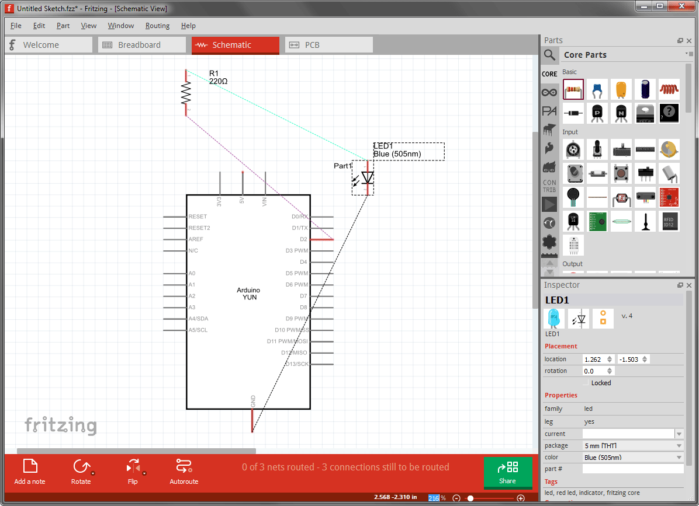
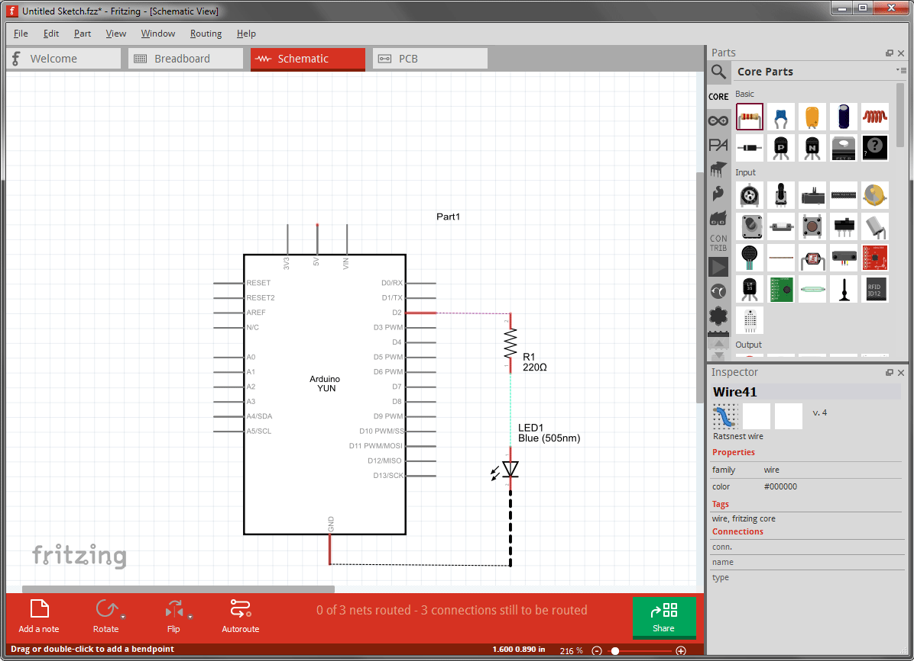
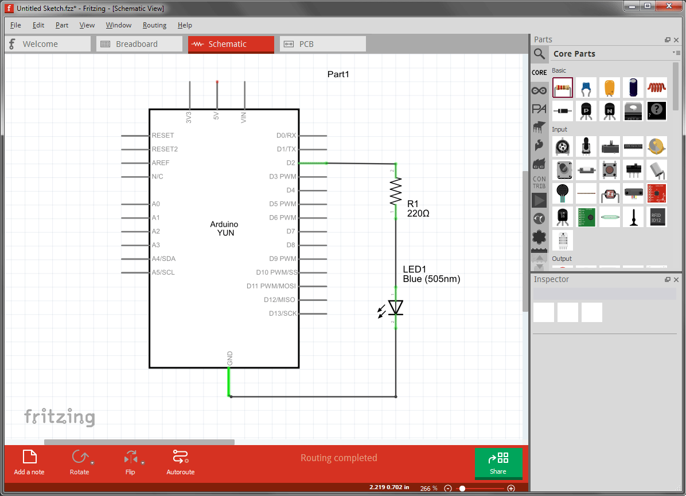

## Schematic View ##

### 1. how to use ###

The schematic view is the classical way to communicate about builded circuits. Its aim is to document your circuit in a way an electrical ingeneur works with electronics.

1. the componets you used in the breadboardview are now symbols. the electrical connections you build in breadboardview are now visible in these dotted lines. let's call them "ratsnest".
	

2. sort the componets around the arduino board.

3. make wires from the ratsnest
	

4. look at the clean schematic diagram you have now from your circuite.
	

If you now ask yourself of the need of this view it's somekind of normal. But if you use it more and more, you will discover how easy it is to read schematic from allready developed things and you could even start from a schematic to build a prototyp or test circuite. 	
