## PCB view ##

### 0. Before we start ###
Fritzing's PCB View let you design and export layout files for single-sided, DIY Printed Circuit Boards. You can also export your sketch to Gerber files, and send them to a professional PCB manufacturing service or easily use the [Fritzing-Fab-Service](http://fab.fritzing.org). The Service makes it possible for you, ordering your designed board, directly from the fritzing fzz file, as a professional pcb. Once you get to know Fritzing's PCB design tools and functions, creating a nice layout will become easier.
Changes in the software are constantly being made in order to improve and make this process easier for you, so please be aware that some bugs might come and go...

To learn how to use Fritzing's PCB design tools, go through the following steps and guidelines.

### 1. the PCB view ###
So your circuit works and also looks great in Fritzing's Breadboard View.

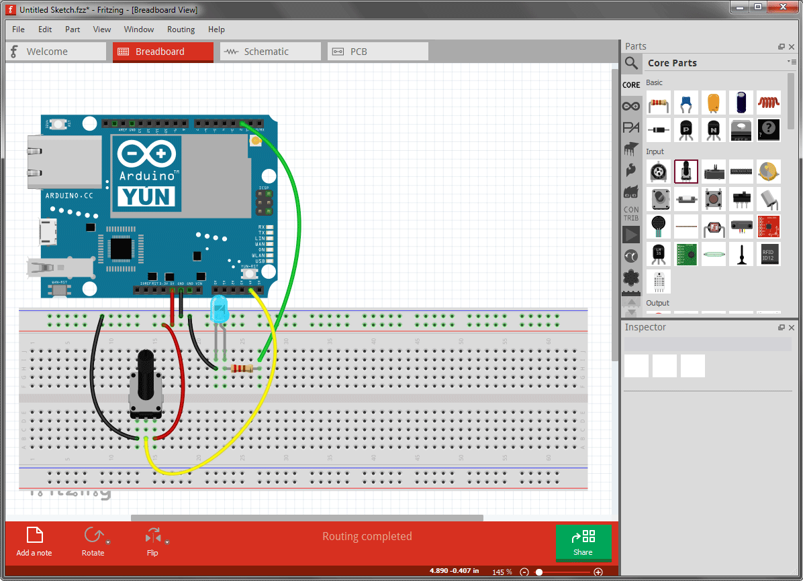

Let's now have a look at the PCB View. To switch to the PCB View use the Navigator or the View Switcher. While it is very easy to recognize parts in the Breadboard View, the PCB View might look a bit confusing at first glance. The reason for this is that the PCB View only shows the necessary information needed for the PCB design. This information is shown in different layers. To view or hide layers, use the View options in the menu bar. Learn more about the PCB View layers.
As an example, lets have a look first at the following circuit which was created in Breadboard View:

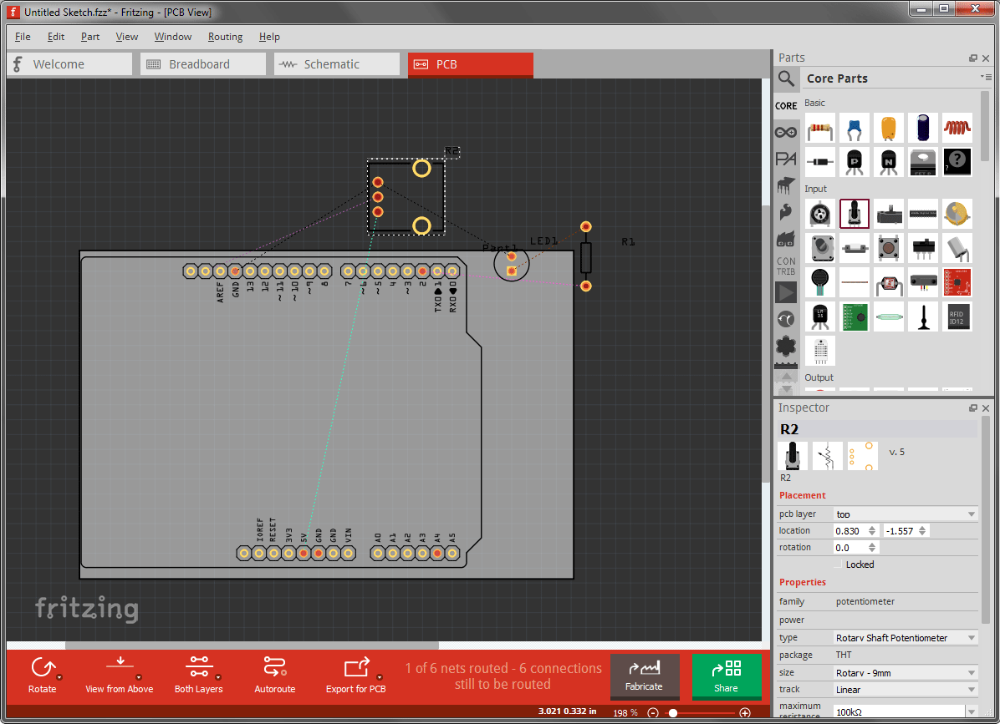

Selecting PCB View in the Navigator will show a completely different illustration of the same circuit.
The with rectangle is the board itself, on which parts will be arranged. It is automatically placed as you open a new sketch.
Parts are shown as footprints, including the Arduino footprint, and you can identify them by selecting or placing the cursor on them to see their labels.
The thin connecting lines are the Rat's Nest (more about the Rat's Nest below).

You might want to resize the board, or use an Arduino shield or a board with a custom shape. Select the board and choose/edit your prefered shape in the Inspector.

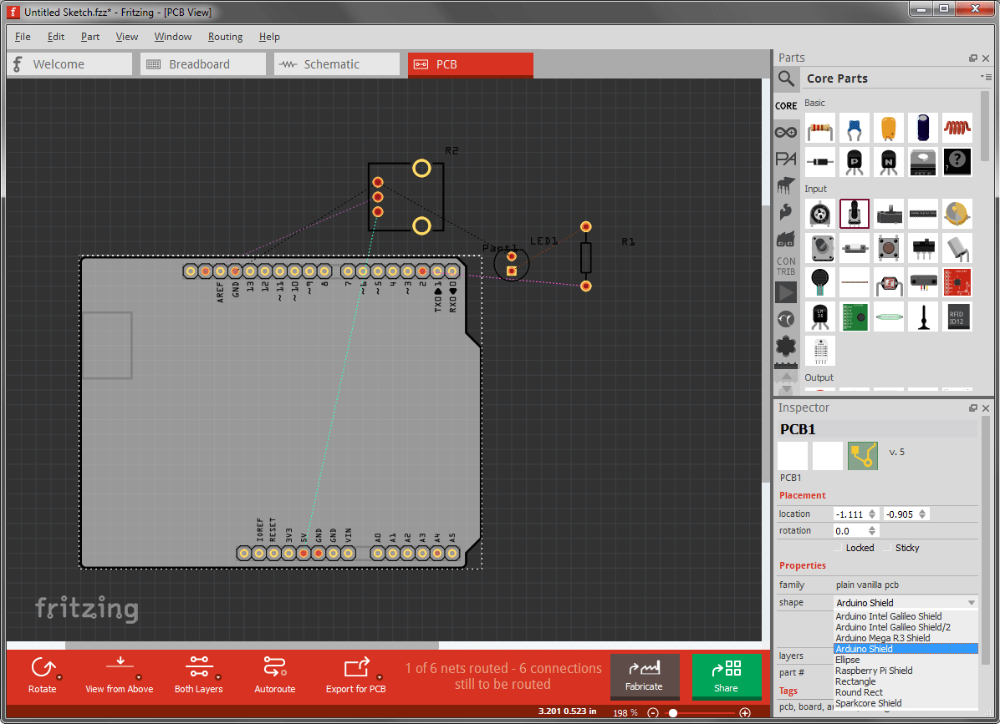

### 2. Arranging parts on the board ###
The first step in designing a PCB layout is arranging the parts on the board.
There are some very important issues to consider here, because the location of parts on the board will have a great effect on how successful the routing process will be.
Follow these guidelines:

1. Place the parts with the most connections in the middle of the board.
2. Notice that Arduino's footprint should also be positioned on the board, just like other parts.
3. Rotate and position parts, leaving enough space between them (don't forget their actual size!).
4. Use a grid like 0.1inch or 0.05inch. Most of the parts fits into this grid and it makes the design process much easier and faster.
4. If the board is too small, redefine its width and height in the Inspector or alternatively resize the board by dragging its corners. **Learn how to design a PCB with a custom shape.**
5. Don't place parts too close to the edges of the board.
6. To avoid short circuits, don't place parts too close to the USB connector outline on the Arduino Shield.
7. When designing stack shields, parts' heights should also be considered.

The following screenshot shows one out of many possible part arrangements for the given circuit:
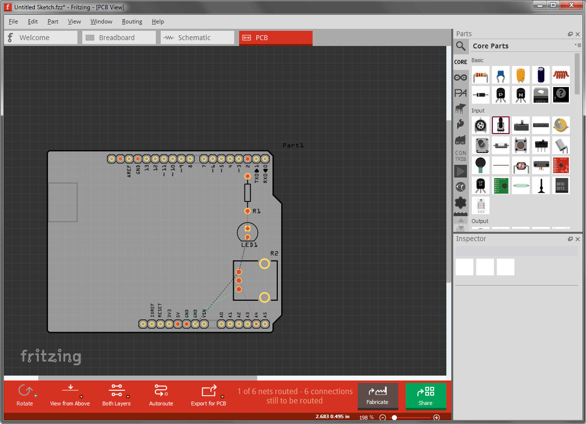

### 3. Hand-routing ###

Use any of the following methods to hand-route traces and jumpers:

1. The safest way is to right-click a Rat's nest wire and choose "Create Trace from Selected Wire(s)" or "Create Jumper from Selected Wire(s)". This will avoid making any changes in the circuit that you built in Breadboard View.
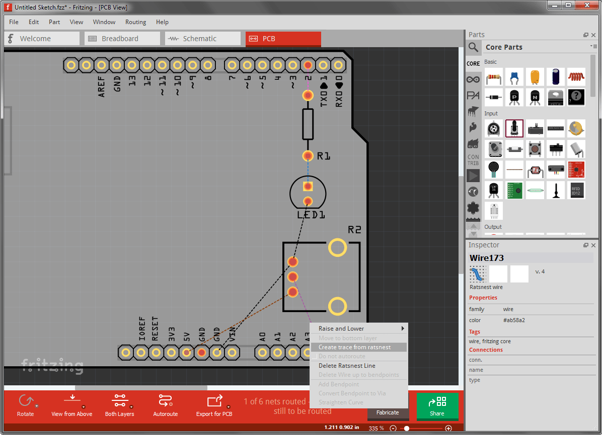

2. Another way is to simply click a part's connector, and drag to make a connection. A trace will be created. To create a jumper, just right-click on the trace and choose "Create Jumper from Selected Wire(s)". To avoid incorrect wiring, we strongly recommend you follow the Rat's nest wire connections while using this method.
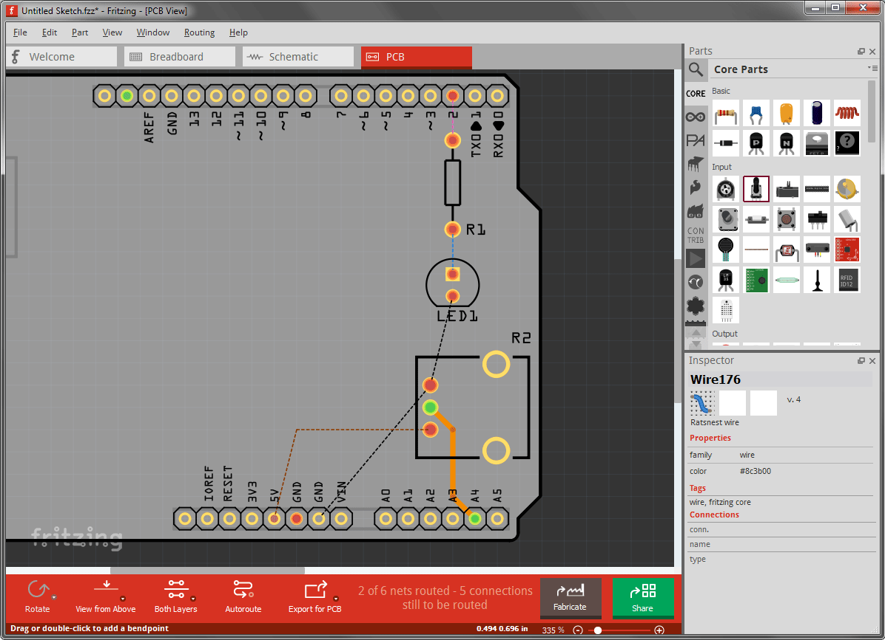
3. You can use both sides of the pcb to make a suiteable wireing. So it is possible to sent traces to top and bottom of the pcb.

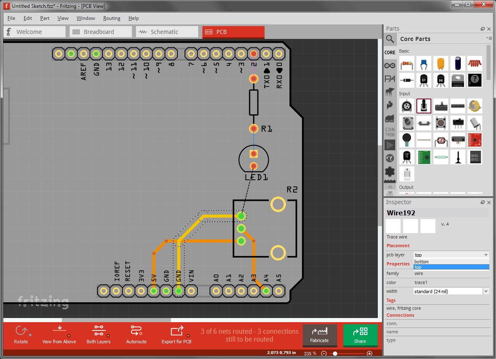

Note that while clicking and holding on a connector, all equipotential connectors are highlighted (in yellow). This shows the whole set of connections attached to this particular connection, and can really help to make hand-routing decisions. Once again, take good care not to cross wires!

### 4. Auto-routing (not recommanced) ###

After positioning all parts on the board, be aware that parts are not really connected to each other yet. The thin connecting lines that you see (Rat's Nest Layer) only act as a guideline. We would now want Fritzing to automatically generate the connection traces between parts. Click the Auto-route function from the bottom menu bar.

If you notice that Fritzing is struggling trying to generate a connection, you can press the "Skip this Trace" button or "Cancel Auto-routing" in the bottom menu while in process.
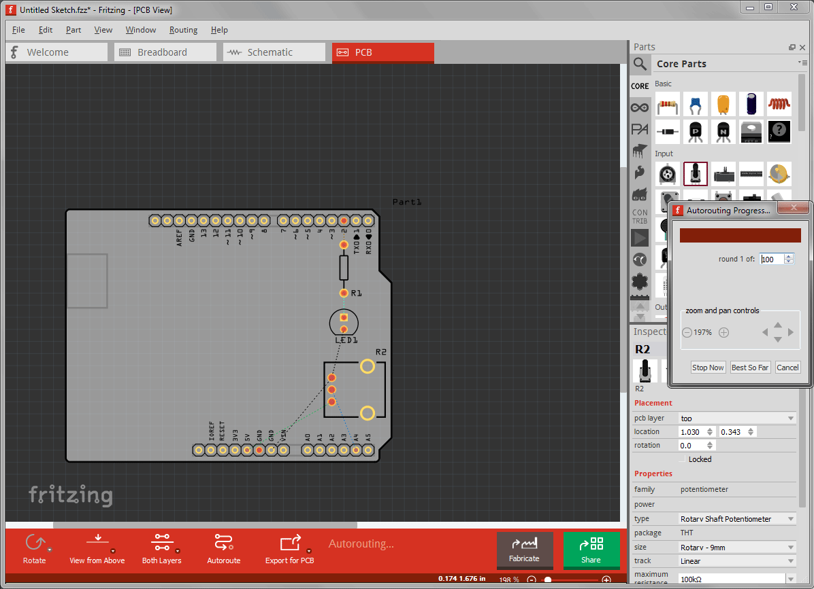

Such a problem might happen because parts were not arranged properly on the board or when there is just no possible route. You will then need to Hand-route the trace or create a jumper. Jumpers are connections that need to be soldered with external wires. These are shown as blue connections while traces are shown as orange ones.
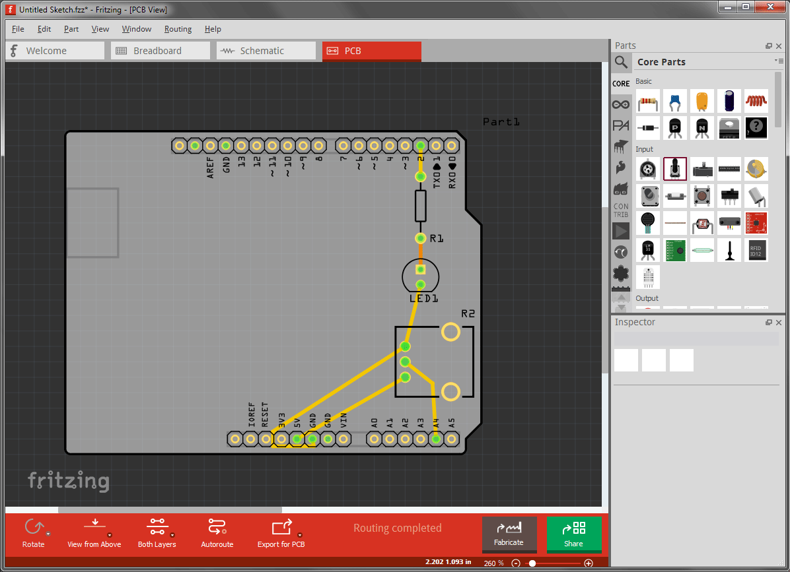

If you are happy with some of the traces and want to keep them untouched, or you know in advance that some connections need jumpers, you might want to tell Fritzing to exclude some connections in the auto-routing process. To do so, select the connections you want to exclude, choose "Don't Autoroute this trace" in the right-click menu or in the Trace menu. Only then press Auto-route. The selected traces will be left untouched while all other connections will be auto-routed. Any traces that were handrouted are automatically marked as "Don't Autoroute."
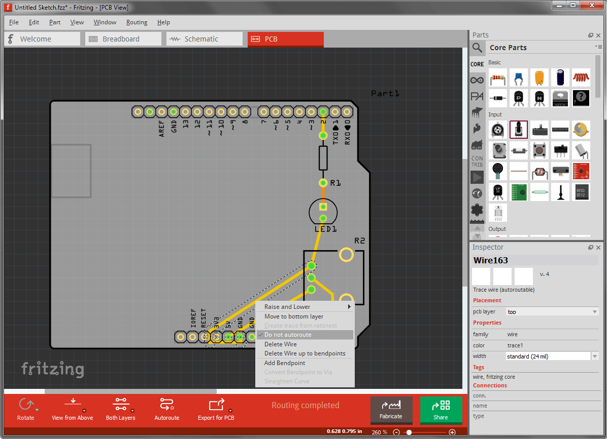

Be aware that if you moved a part after auto-routing or hand-routing, the routing traces are not corrected automatically. You will need to be cautious when moving parts and make sure you don't create any short circuits.

### 5. Guidelines for better routing ###

For both auto- and hand-routing, follow these guidelines:

1. Place the parts with the most connections in the middle of the board.
2. Try to get short connections by moving and rotating parts.
3. Use the highlighting of equipotential connectors feature.
4. Add bend points for tidy routing and so that lines do not cross.
5. Don't forget the traces can go under parts like resistors.
6. Use jumper wires instead of watching the auto-route go crazy.
7. Choose a good grid (e.g. 0.1inch) and "align to grid"-option for a straight forward routing and design process
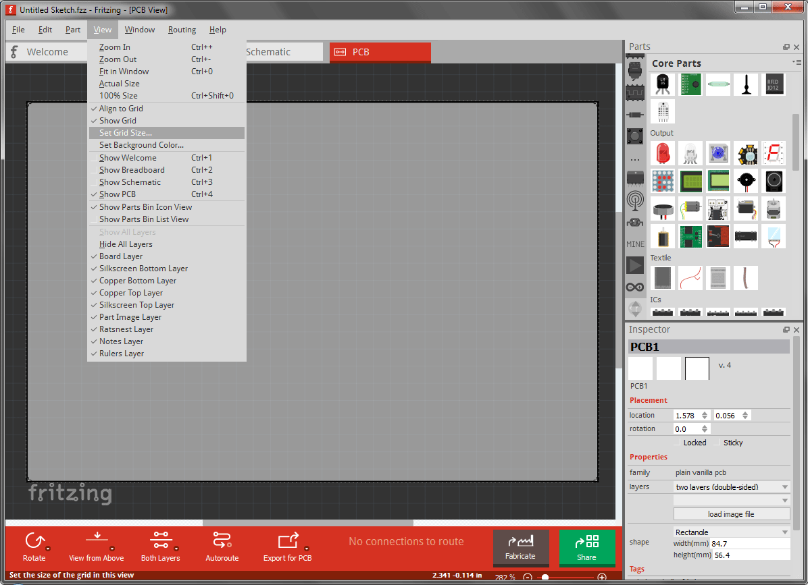

### 6. Editing Traces ###

To achieve a better and nicer design, you would need to edit traces by moving, adjusting width and adding bend points. Width adjustment can be done in the Inspector. Please note that thin traces might ruin in a DIY PCB production, so keeping traces in medium thickness is safer. To create a bend points drag it simply out of a trace.

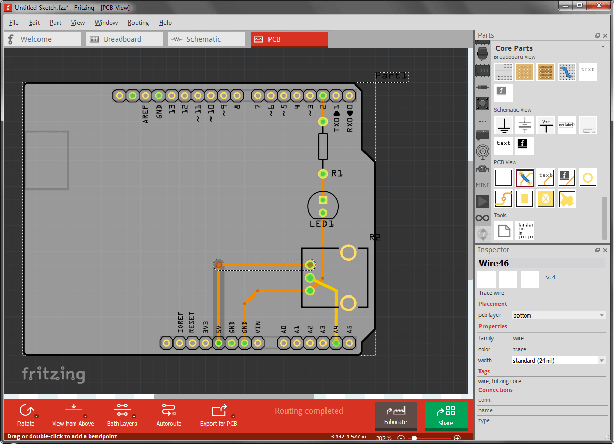

Sometimes, it would be possible to edit traces in a way that will reduce the number of  jumpers. The routing in the screenshot above was edited and a better design was achieved:
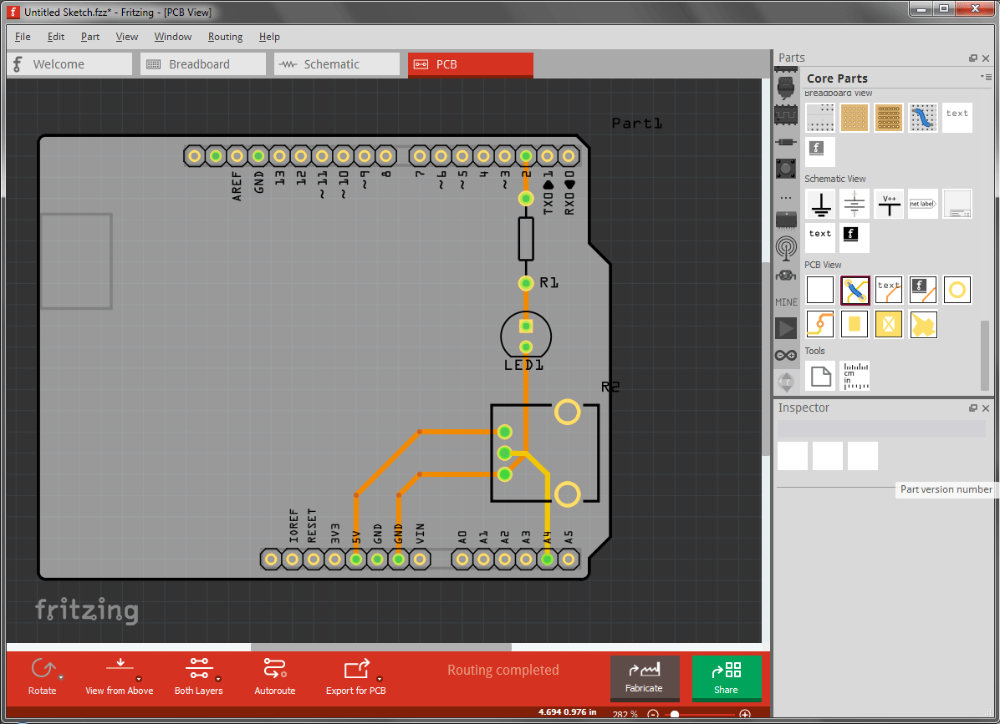

### 7. Export Options ###

Fritzing features a variety of export options. When you are happy with your PCB design, you can choose to export JPG, PNG, etchable PDF and even Gerber files (for sending a professional PCB manufacturing service). The Bill of Materials option generates a list of all parts in the circuit.
From the menu bar choose File > Export > and the desired format.

- For DIY PCB production, use the Etchable PDF option which exports only the necessary design for etching.
- When exporting Gerber files, create a folder for the gerbers, and zip. it before sending to a manufacturer.
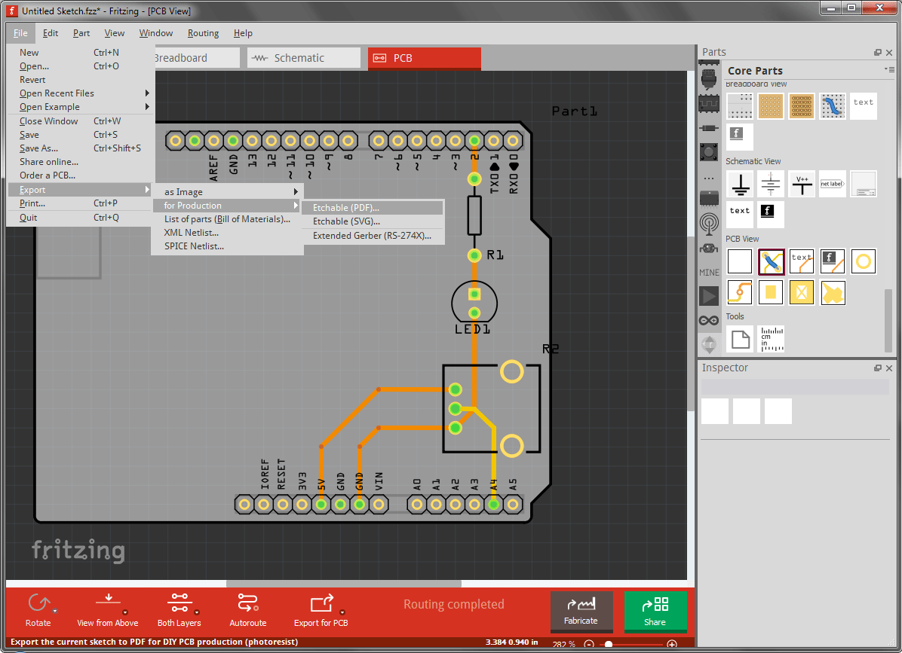

Or you try the [Fritzing-Fab-Service](http://fab.fritzing.org) by useing the "Farbricate" button in the pcb-views bottom. it will let you order directly from the fritzing sketch. Hovering the button gives you a feeling about the fab-price per board and the discount if you need more copies.
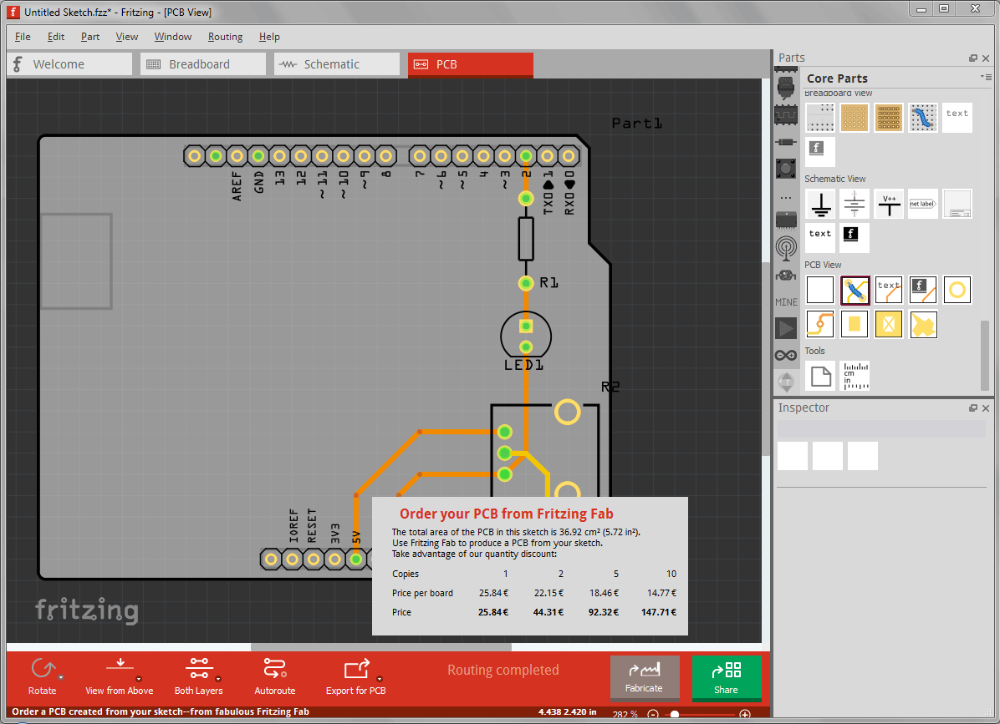

So hopefully, this tutorial helped you understand the PCB design process. Good luck and show us what you've done!
